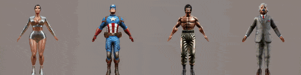
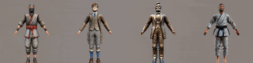
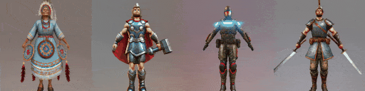
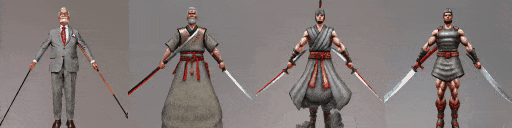
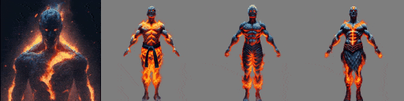
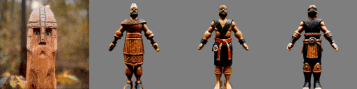
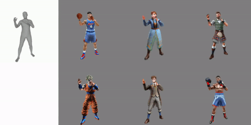
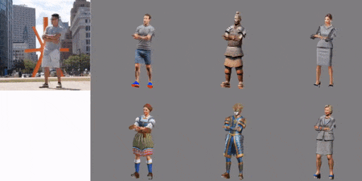

<p align="center">

  <h2 align="center">AvatarStudio: High-fidelity and Animatable 3D Avatar Creation from Text</h2>
  <p align="center">
    <a href="http://jeff95.me/"><strong>Jianfeng Zhang*</strong></a>
    ·
    <a href="https://scholar.google.com.sg/citations?user=8gm-CYYAAAAJ&hl=en"><strong>Xuanmeng Zhang*</strong></a>
    ·
    <a href="mailto:zhanghuichao.hc@bytedance.com"><strong>Huichao Zhang</strong></a>
    ·
    <a href="https://scholar.google.com.sg/citations?user=8gm-CYYAAAAJ&hl=en"><strong>Jun Hao Liew</strong></a>
    ·
    <a href="https://zhangchenxu528.github.io/"><strong>Chenxu Zhang</strong></a>
    ·
    <a href="https://scholar.google.com.sg/citations?user=RMSuNFwAAAAJ&hl=en"><strong>Yi Yang</strong></a>
    ·
    <a href="https://sites.google.com/site/jshfeng/home"><strong>Jiashi Feng</strong></a>
    <br>
    <br>
        <a href="assets/preprint/AvatarStudio.pdf"></a>
        <a href=""></a>
        <a href='http://jeff95.me/projects/avatarstudio.html'></a>
  </p>
  
  <table align="center">
    <tr>
      <td align="center" colspan="2"><b>3D Avatar Creation</b></td>
    </tr>
    <tr>
    <td>
      
    </td>
    <td>
      
    </td>
    </tr>
    <tr>
    <td>
      
    </td>
    <td>
      
    </td>
    </tr>
    <tr>
      <td align="center" colspan="2"><b>Stylized Avatar Generation</b></td>
    </tr>
    <tr>
    <td>
      
    </td>
    <td>
      
    </td>
    </tr>
    <tr>
    <td>
      
    </td>
    <td>
      
    </td>
    </tr>
    <td align="center" colspan="2"><b>Multimodal Avatar Animation</b></td>
    <tr>
    <td>
      
    </td>
    <td>
      
    </td>
    </tr>
  </table>

*Introducing AvatarStudio, a generative model for high-fidelity and animatable human avatar creation from text. It supports various applications, including stylized avatar generation and multimodal animation.*

## 📢 News

- [2023-11-30]: Repo created. Code will come soon. Stay tuned! Check our project page [here](http://jeff95.me/projects/avatarstudio.html).

<!-- ## ⚒️ Requirements
* We recommend Linux for performance and compatibility reasons.
* 1 high-end NVIDIA GPUs. We have done all testing and development using V100 GPUs.
* Install `Python >= 3.8` and `PyTorch >= 1.12`. We have tested on `torch1.12.1+cu113` and `torch2.0.0+cu118`, but other versions should also work fine.
* (Optional, Recommended) Install ninja to speed up the compilation of CUDA extensions:```pip install ninja```
* Install dependencies: ```pip install -r requirements.txt ```
## 🏃‍♂️ Getting Started

#### Clone the gitlab code and necessary files:

```bash
git clone https://github.com/magic-research/avatarstudio.git
``` -->


<!-- ## 🙀 Train the model
You can train new models using `launch.py`. For example:
```bash
python3 launch.py --config configs/avatarstudio.yaml --train --gpu 0 system.prompt_processor.prompt="Captain America, Marvel Character"
```

## 🙉 Inference
You can generate the multi-view visualization with `launch.py`. For example: 
```bash
python3 launch.py --config /path/to/trial/dir/configs/parsed.yaml --test --gpu 0 resume=path/to/trial/dir/ckpts/last.ckpt
```
You can specify `--img_res` to be the image resolution and `--resume_pretrained` to be the path of checkpoints.  -->


## 🙏 Credit

AvatarStudio builds upon several previous works:
- [threestudio](https://github.com/threestudio-project/threestudio)
- [GET3D](https://github.com/nv-tlabs/GET3D)
- [GETAvatar](https://github.com/magic-research/GETAvatar)

We would like to thank the authors for their contribution to the community!


## 🎓 Citation
If you find our work useful, please consider citing:
```latex
@inproceedings{zhang2023avatarstudio,
    title={AvatarStudio: High-fidelity and Animatable 3D Avatar Creation from Text},
    author={Zhang, Jianfeng and Zhang, Xuanmeng and Zhang, Huichao and Liew, Junhao and Zhang, Chenxu and Yang, Yi and Feng, Jiashi},
    booktitle={arXiv},
    year={2023}
}
```

